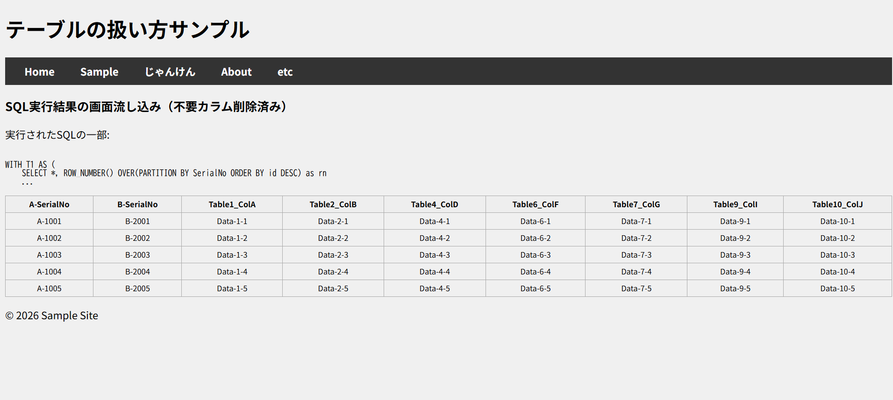

## PDFの作成
> 基本的な使い方
```php
require('tfpdf.php');

$pdf = new tFPDF();
$pdf->AddPage();
// フォントの設定（重要: tFPDFはUnicode対応）
$pdf->AddFont('DejaVu','','DejaVuSansCondensed.ttf',true);
$pdf->SetFont('DejaVu','',14);
$pdf->Cell(40,10,'こんにちは、tFPDFです！');
$pdf->Output();
```
### tFPDFのダウンロードと導入手順
1. [公式サイト](https://fpdf.org/en/script/script92.php)へアクセス:
> FPDF公式サイトのダウンロードページ にアクセスします。
2. tFPDFのダウンロード:
>ページ内で「tFPDF」のリンクを探し、最新のzipファイル（例: tfpdf.zip）をダウンロードします。
解凍と配置:
3. zipファイルを解凍し、中にある tfpdf.php と font フォルダをプロジェクトの適当なディレクトリにコピーします。

## 実行結果

http://localhost:8080/index.php   
or    
http://localhost:8080/index.php?page=home


http://localhost:8080/index.php?page=sample


http://localhost:8080/index.php?page=createPDF
> インターネットとセキュリティのPDFを表示するのリンクをクリックする。


http://localhost:8080/index.php?page=createPDF&action=generate
http://localhost:8080/index.php?page=sample


### 以下が実際のコード
[https://github.com/kenriki/purePHPnoFrameWork/commit/afc419d1c084268a2db7ae2ab444770568adbed3](https://github.com/kenriki/purePHPnoFrameWork/commit/afc419d1c084268a2db7ae2ab444770568adbed3)

## 実行結果
http://localhost:8080/index.php?page=sample2



### 以下が実際のコード
[https://github.com/kenriki/purePHPnoFrameWork/commit/827b59dc945c201ba7cb7343cc861fdfa33135b4](https://github.com/kenriki/purePHPnoFrameWork/commit/827b59dc945c201ba7cb7343cc861fdfa33135b4)

## ユニットテスト
### 環境準備
> powershellでインストール
```terminal
Invoke-WebRequest -Uri https://phar.phpunit.de -OutFile phpunit.phar
```
または
```terminal
curl.exe -LO https://phar.phpunit.de
```

> html生成後に、HTML開いて、phpUnitのバージョンをインストール。
```terminal
php phpunit.phar --version > phpunit_ver.html
```

### 実行コマンド
> lib フォルダの中に移動した PHPUnit を使って、プロジェクト全体（tests フォルダ内すべて）のテストを実行するには、以下のコマンドを打ちます。
```terminal
# sample2 フォルダにいる状態で実行
php .\lib\phpunit-13.0.5.phar
```

### テスト結果
> テスト結果を tests/result/ に保存する方法
> PHPUnit 本来のログ機能を使うのが一番スマートです。コマンド実行時にオプションを付けることで、結果をテキストファイルとして書き出せます。
PowerShell で以下のコマンドを実行してみてください。

```terminal
New-Item -ItemType Directory -Force tests/result
```

```terminal
php .\lib\phpunit-13.0.5.phar tests/CreatePDFControllerTest.php --log-teamcity tests/result/testCreatePDFController.txt
```
または
> 通し実行したいとき
```terminal
php .\lib\phpunit-13.0.5.phar --testdox
```

### テスト結果ログ
```terminal
PS C:\Apache24\htdocs\sample2> php .\lib\phpunit-13.0.5.phar tests/CreatePDFControllerTest.php --log-teamcity tests/result/testCreatePDFController.txt
PHPUnit 13.0.5 by Sebastian Bergmann and contributors.

Runtime:       PHP 8.5.3
Configuration: C:\Apache24\htdocs\sample2\phpunit.xml

W                                                                   1 / 1 (100%)

Time: 00:00.015, Memory: 26.00 MB

There was 1 PHPUnit test runner warning:

1) Test results may not be as expected because the XML configuration file did not pass validation:

  Line 5:
  - Element 'phpunit', attribute '{http://www.w3.org}noNamespaceSchemaLocation': The attribute '{http://www.w3.org}noNamespaceSchemaLocation' is not allowed.


OK, but there were issues!
Tests: 1, Assertions: 1, PHPUnit Warnings: 1, Warnings: 1.
```

## テスト結果の総括メモ
> なぜ TeamCity 形式だと大丈夫なのか？
PHPUnit の通常の出力（--testdox など）は、テストが最後まで正常に終わってからまとめて結果を表示・保存しようとします。しかし、generate() で exit; が走ると、保存処理が行われる前に PHP 自体が終了してしまい、ファイルが書き込まれません。

> 一方で、--log-teamcity はテストが始まった瞬間から 「今からこのテストを始めるよ」「今終わったよ」とリアルタイムで一行ずつ書き出します。そのため、途中で exit; で強制終了しても、それまでの記録（testShow の結果など）がファイルに残るのです。
--testdox（読みやすい形式）でも「しっかり」出すための解決策
現状、generate() のテストが走ると強制終了してしまうため、以下のどちらかの対応が必要です。

1. generate() の呼び出しを一旦コメントアウトする
まずは show() だけが確実に動くことを確認するために、tests/CreatePDFControllerTest.php の testGenerate メソッドの中身を一旦コメントアウトしてみてください。
これで php .\lib\phpunit-13.0.5.phar --testdox を実行すれば、all_tests_report.txt にも「しっかり」結果が出るはずです。

2. generate() の exit; 問題を根本解決する
public/createPDF.php の最後に exit; があると、どんなに工夫しても PHPUnit は「異常終了」とみなしてしまいます。
これを以下のように書き換えるのが、Composer を使わない環境での一番の正解です。

```php
// public/createPDF.php の最後
if (php_sapi_name() !== 'cli') {
    exit;
}
```