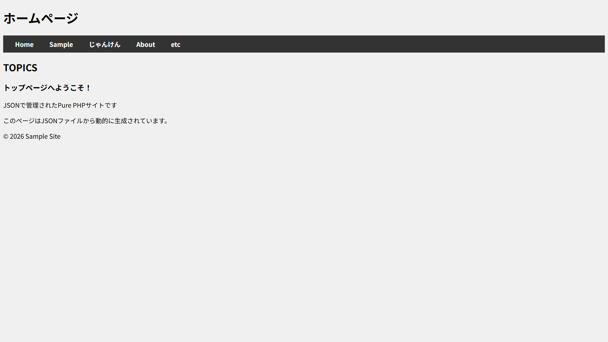
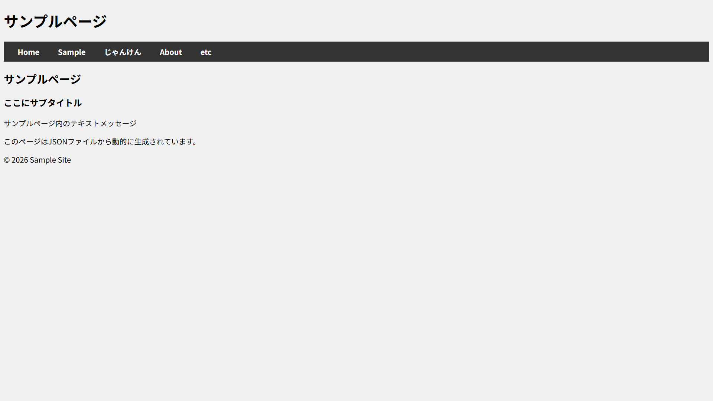
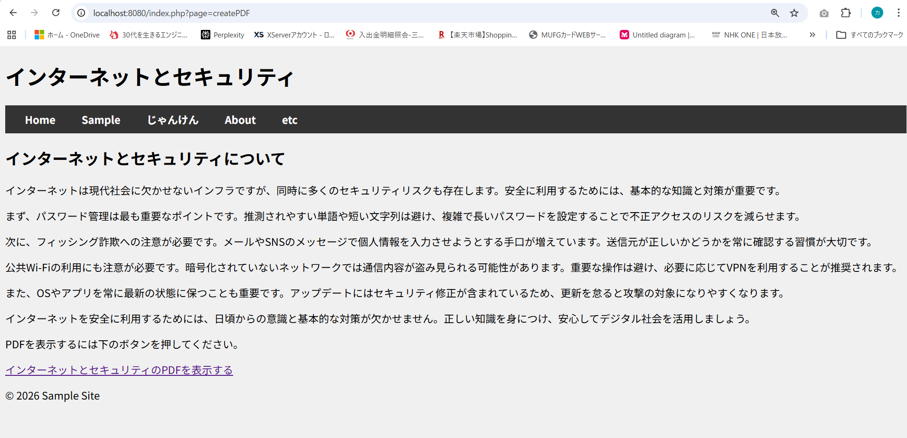
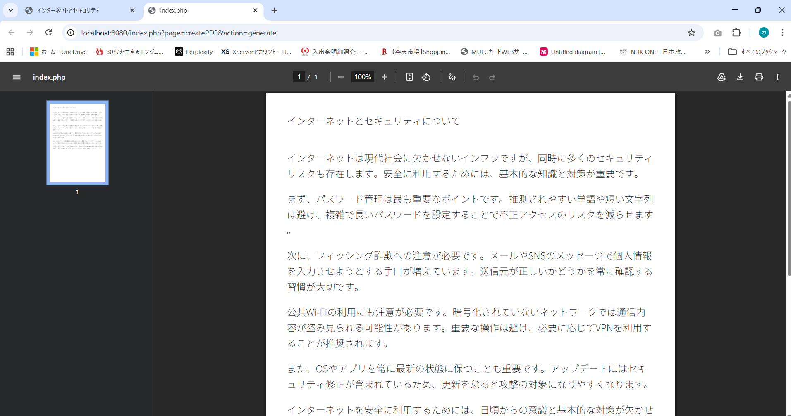

## PDFの作成
> 基本的な使い方
```php
require('tfpdf.php');

$pdf = new tFPDF();
$pdf->AddPage();
// フォントの設定（重要: tFPDFはUnicode対応）
$pdf->AddFont('DejaVu','','DejaVuSansCondensed.ttf',true);
$pdf->SetFont('DejaVu','',14);
$pdf->Cell(40,10,'こんにちは、tFPDFです！');
$pdf->Output();
```
### tFPDFのダウンロードと導入手順
1. [公式サイト](https://fpdf.org/en/script/script92.php)へアクセス:
> FPDF公式サイトのダウンロードページ にアクセスします。
2. tFPDFのダウンロード:
>ページ内で「tFPDF」のリンクを探し、最新のzipファイル（例: tfpdf.zip）をダウンロードします。
解凍と配置:
3. zipファイルを解凍し、中にある tfpdf.php と font フォルダをプロジェクトの適当なディレクトリにコピーします。

## 実行結果

http://localhost:8080/index.php   
or    
http://localhost:8080/index.php?page=home



http://localhost:8080/index.php?page=sample


http://localhost:8080/index.php?page=createPDF
> インターネットとセキュリティのPDFを表示するのリンクをクリックする。



http://localhost:8080/index.php?page=createPDF&action=generate
http://localhost:8080/index.php?page=sample


### 以下が実際のコード
[https://github.com/kenriki/purePHPnoFrameWork/commit/afc419d1c084268a2db7ae2ab444770568adbed3](https://github.com/kenriki/purePHPnoFrameWork/commit/afc419d1c084268a2db7ae2ab444770568adbed3)